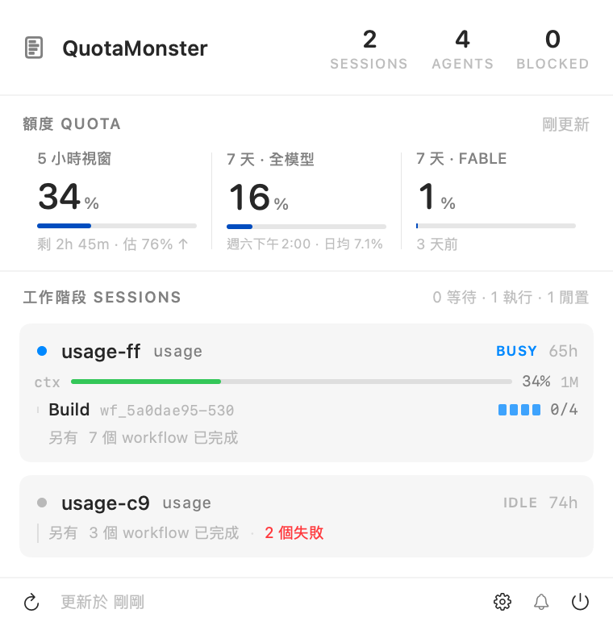

<div align="center">


# QuotaMonster

**看著 Claude Code 的額度與工作階段的 macOS 選單列 app。**
不出聲地待在選單列，只在真的有人在等你的時候才叫你。

[](LICENSE)
[](#系統需求)
[](#系統需求)

</div>

---

## 它解決什麼問題

Claude Code 的額度資訊散在三個地方，而且每一個都不完整：

- **`~/.claude.json` 的 `cachedUsageUtilization`** —— 實測可以整整 16 小時不更新，
  而且已經重置的窗口還留在裡面。
- **狀態列** —— 是活的，但只看得到**你正在看的那一個** session。
- **磁碟上沒有任何地方**記錄額度**隨時間**的變化。Claude Code 只存「現在是多少」。

QuotaMonster 把這三件事收成一個選單列圖示：還剩多少、誰在跑、誰在等你。

<div align="center">
  
</div>

> 上面那張圖是 `--render-panel` 產出來的。⚠️ 它是**接**出來的：SwiftUI 的
> `ImageRenderer` 畫不出 `ScrollView`，所以 session 列另外渲染再接回中段的空白帶。
> 沒有任何內容被蓋住，但它不是一張截圖。

---

## 選單列圖示

圖示本身就是儀表，不需要打開面板：

| 你看到的 | 意思 |
|---|---|
| **外弧** | 5 小時窗口還剩多少 |
| **內弧** | 7 天窗口還剩多少 |
| **顏色** | 藍 = 寬裕（>50%）、綠 = 偏緊（>20%）、紅 = 快沒了 |
| **單色不上色** | **讀數不可信**（沒有讀數，或已過期）。對不知道的值塗綠色是說謊 |
| **底部那排點** | 幾個 agent 在跑（4 個以上合併成一條橫槓） |
| **琥珀色滿環 + 箭頭**（會呼吸） | **有人在等你輸入。** 琥珀色只有這一個意思 |
| **生物染成丁香紫** | 剛剛有一個長工作結束了 |

---

## 系統需求

- **macOS 14 或以上**（binary 的 `minos` 是 14.0）。
  ⚠️〔推論，非實測〕開發機是 macOS 27，**我沒有在 14/15/16 上實際跑過**。
  如果你在較舊的系統上遇到問題，開一個 issue 告訴我。
- **Apple Silicon 專屬**（`lipo -info` → `arm64`）。Intel Mac 跑不起來 ——
  這是刻意的取捨，不是疏漏。
- 不需要 Xcode（用 Command Line Tools 就能從原始碼建置）。

---

## 安裝

### 方法一：下載 DMG

> ### ⚠️ 這個 DMG 沒有經過 Apple 公證，所以 Gatekeeper 會擋它
>
> 作者只有免費的 Apple ID，簽章等級是 *Apple Development*，
> **不是** Developer ID —— 而公證需要付費的 Apple Developer Program 帳號。
> 〔實測〕`spctl -a -vvv QuotaMonster.app` 現在就回 `rejected`。
>
> 這不是「應該沒問題」的情況，是「一定會被擋」。你有兩個選擇：

把 `QuotaMonster.app` 拖進「應用程式」之後，**擇一**：

```bash
# A. 在 Finder 裡對著 app 按右鍵 →「打開」→ 再按一次「打開」
#    （雙擊不會給你這個選項，一定要右鍵）

# B. 自己拿掉隔離屬性
xattr -d com.apple.quarantine /Applications/QuotaMonster.app
```

如果你不信任一個沒有公證的 binary —— **那是對的反應**。用方法二。

### 方法二：自己建置（推薦）

```bash
git clone <this repo>
cd usage
bash scripts/make_app.sh          # 建置 + 組 .app + 裝到 ~/Applications
open ~/Applications/QuotaMonster.app
```

`make_app.sh` 會用 `CODESIGN_IDENTITY` 這個環境變數簽章；沒設就走 ad-hoc 簽章
（自己建置的 app 不會被 Gatekeeper 擋，因為它沒有隔離屬性）。

---

## statusline tee（選用，但強烈建議）

沒有它，QuotaMonster 只能讀 `~/.claude.json` —— 那份資料**實測可以 16 小時不更新**。
裝了它，額度數字就跟著 API 回應走，是秒級的。

做法是在 Claude Code 與你原本的狀態列腳本之間夾一支 wrapper：payload 收下來寫進快取，
然後**一個 byte 不差**地交棒給你原本的腳本。

```bash
bash scripts/install_statusline_tee.sh              # 只印 diff，什麼都不改
bash scripts/install_statusline_tee.sh --apply      # 真的安裝
bash scripts/install_statusline_tee.sh --uninstall --apply   # 還原
```

它對你的環境做什麼，以及為什麼可以信任它，寫在 [SECURITY.md](.github/SECURITY.md)。
簡短版：只動 `~/.claude/settings.json` 裡 `statusLine.command` **一個字串**，
動手前留時間戳備份，原始命令原樣存起來，`--uninstall` 逐 byte 還原。

---

## 隱私

**這個 app 不連網。** 〔實測〕`git grep -nE "URLSession|URLRequest|NWConnection|socket\(" -- Sources/`
零命中。它只讀本機檔案、只寫自己的快取。完整清單見 [SECURITY.md](.github/SECURITY.md)。

---

## 偏好設定

點面板右下的齒輪。**只有四項**，而那是設計不是省事：

音效 · 「靜音到明早」的明早是幾點 · context 的黃/紅門檻 · 額度的緊張門檻

這個 app 有將近三十個門檻，其餘的都不給調。判準是
**「這個量測是一條曲線，還是一條界線」** —— 曲線可以調（動它只是沿著量過的線移動），
界線不行（動它讓量測作廢）。而且**使用者親自選過不等於它是口味**：
調壞的方向如果是**無聲**的，就不該做成旋鈕。

---

## 診斷

```bash
QuotaMonster.app/Contents/MacOS/QuotaMonsterApp --dump           # 資料層：讀到什麼、從哪讀的、為什麼選它
QuotaMonsterApp --render-panel out.png                           # 面板版面
QuotaMonsterApp --render ./glyph-out [--dark]                    # 選單列圖示的所有狀態（1x/2x/8x）
QuotaMonsterApp --render-icon ./AppIcon.iconset                  # app icon
QuotaMonsterApp --trace-alerts 120                               # 通知決策的影子量測
QuotaMonsterApp --probe-login                                    # 開機自動啟動的狀態
```

⚠️ **配色一律用 `--dark` 檢查，而且判配色要看 2x** —— Retina 的選單列是 2x，
1x 是最壞情況（外接非 Retina 螢幕）。完整對照表在 `docs/quotamonster.md` 第四節。

---

## 開發

```bash
bash scripts/test.sh                        # ⚠️ 不可以直接 swift test
rm -rf .build && swift build -c release     # ⚠️ 增量建置的 Build complete 是假象
bash scripts/test_statusline_tee.sh         # shell 層：狀態列一個 byte 都不能變
bash scripts/test_install_statusline_tee.sh
```

**接手前請讀 [`docs/quotamonster.md`](docs/quotamonster.md)** —— 32 條不可違反的規矩、
16 條寫下來的拒絕、27 處「曾經這樣想、後來被資料推翻」，每一條都附證據。

> ⚠️ **`docs/build-log.md` 是施工紀錄，不是現況。** 它裡面有**已知是錯的敘述**
> （哪些錯了列在 `docs/quotamonster.md` 第三節）。不要拿它當文件讀。

想送 PR 的話，[CONTRIBUTING.md](CONTRIBUTING.md) 把這個 repo 幾條不尋常的規矩講清楚了。

---

## 授權

[Apache License 2.0](LICENSE)
